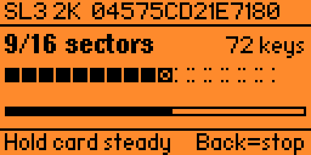
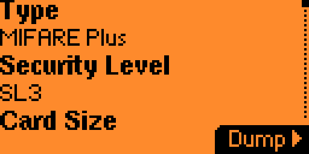
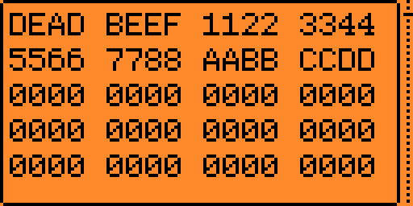
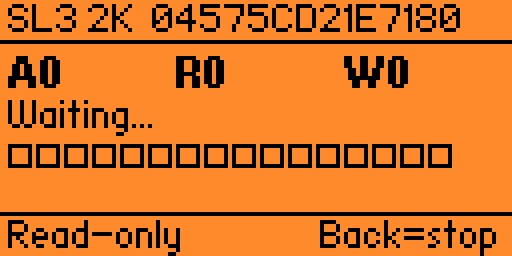

# MFP Reader for Flipper Zero

A standalone Flipper Zero application for reading, dumping and emulating
**MIFARE Plus SL3** smart cards. Implements the full MFP SL3 protocol over
ISO 14443-4A using only stock firmware APIs — no firmware modifications
required.

<p align="center">
  
</p>

| | | |
|---|---|---|
|  |  |  |
| Card identification | Hex viewer | Live emulation |

## Features

- **Card identification** — UID, SAK, ATQA, ATS parsing, manufacturer
  decoding, BCC validation
- **Full dictionary dump** — recovers both KeyA and KeyB for every sector
  using a bundled default dictionary plus any extra `.dic` files you drop
  on the SD card
- **Live visual progress** — sector activity grid that fills in real time
  as keys are found and blocks are read
- **Hex viewer** — scrollable monospace dump of every block
- **Save / load** dumps in a versioned `.mfp` file format with an editable
  file name on save
- **Card emulation** — full MFP SL3 listener implementing GetVersion, Auth
  (First and NonFirst), ReadEncrypted and WriteEncrypted
- **Two emulation modes** — *Writable* (the dump file is updated when the
  reader writes) or *Read-only* (writes are discarded)
- **Delete saved dumps** from inside the app

## Installation

### Via Flipper Apps Catalog (recommended)

Once approved, the app will be available in the official catalog:

- iOS: Flipper Mobile App → Apps → NFC → MFP Reader
- Android: Flipper Mobile App → Apps → NFC → MFP Reader
- Web: [lab.flipper.net/apps](https://lab.flipper.net/apps)

### Manual install

1. Install [uFBT](https://github.com/flipperdevices/flipperzero-ufbt):
   ```sh
   pip install --upgrade ufbt
   ```
2. Clone the repo and build:
   ```sh
   git clone https://github.com/Defensor7/flipperzero-mfp-reader.git
   cd flipperzero-mfp-reader/app
   ufbt
   ```
3. The compiled FAP appears at `dist/mfp_reader.fap`. Copy it to your
   Flipper's SD card under `apps/NFC/`, or with the device connected
   over USB use `ufbt launch` to flash and start it in one step.

## Usage

1. Launch **MFP Reader** from the Apps → NFC menu.
2. Tap **Read card** and place a MIFARE Plus card on the back of the
   Flipper. The Card Info screen shows the decoded card identity.
3. Press **Dump** (right button). Pick a dictionary file. The scan reads
   every sector that responds to one of the keys in the dictionary or in
   the built-in defaults.
4. The result screen shows a sector activity grid with per-sector key
   coverage:
   - filled square — both KeyA and KeyB recovered
   - top half filled — only KeyA
   - bottom half filled — only KeyB
   - dotted corners — sector unreadable
5. Press **Actions** to **Save** the dump (with an editable file name),
   open the **View dump** hex viewer, **Emulate** the card, or view
   **Card Info** again.

To re-open a saved dump, use **Saved cards** from the main menu.

## Dictionaries

The app loads `.dic` files from `/ext/apps_data/mfp_reader/`. On first
launch it creates `mfp_default_keys.dic` with ~20 well-known factory and
development AES keys, plus a `README.txt` explaining the format.

To add your own keys, drop additional `.dic` files into the same folder.
They will appear in the picker on the next dump.

Dictionary file format:

```
# Comments start with '#'
# One 32-character hex AES key per line
FFFFFFFFFFFFFFFFFFFFFFFFFFFFFFFF
A0A1A2A3A4A5A6A7A8A9AAABACADAEAF
```

## File format

Dumps are saved as Version 2 `.mfp` files in
`/ext/apps_data/mfp_reader/`. The format is plain text and human-readable:

```
Filetype: MFP Reader
Version: 2
UID: 04 57 5C D2 1E 71 80
Security Level: 3
Card Size: 2K
Sectors Read: 16
Allow Overwrite: yes
Sector 0: OK KeyA <hex> KeyB <hex>
Block 0: 04 57 5C D2 1E 71 80 08 44 00 01 01 11 00 45 22
...
```

## Compatibility

- Tested on Flipper Zero with stock firmware **API 87.1** (Release 1.4.3
  and newer Release Candidates).
- Works on **MIFARE Plus EV1 SL3 2K** cards. The 4K layout is implemented
  but has not been tested on real hardware.
- Does not work on Plus SL1 (use the built-in MIFARE Classic app instead)
  or DESFire / Ultralight.

## Build requirements

- [uFBT](https://pypi.org/project/ufbt/) targeting Flipper Zero firmware
  API 87.1 or newer
- No external dependencies — `tiny-AES-c` is bundled in `app/lib/aes/`

## Acknowledgments

- [tiny-AES-c](https://github.com/kokke/tiny-AES-c) by kokke — public
  domain AES-128 implementation, bundled because mbedtls is not exported
  from Flipper firmware
- [Proxmark3](https://github.com/RfidResearchGroup/proxmark3) and
  [ChameleonUltra](https://github.com/RfidResearchGroup/ChameleonUltra)
  for reference MFP SL3 implementations used during protocol debugging

## License

[MIT](LICENSE) — see the LICENSE file for details.
